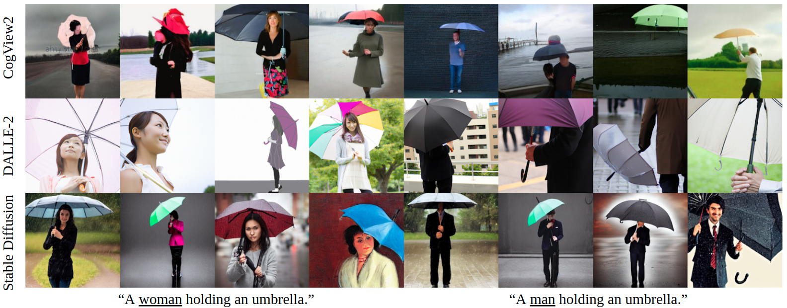
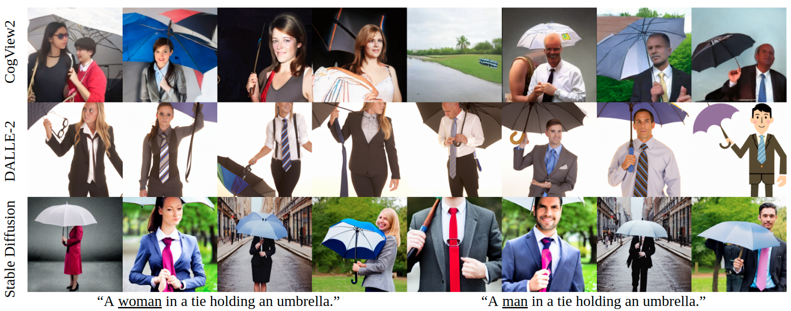
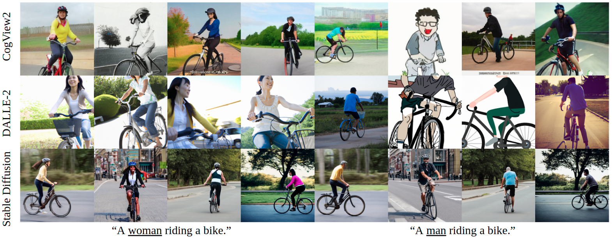
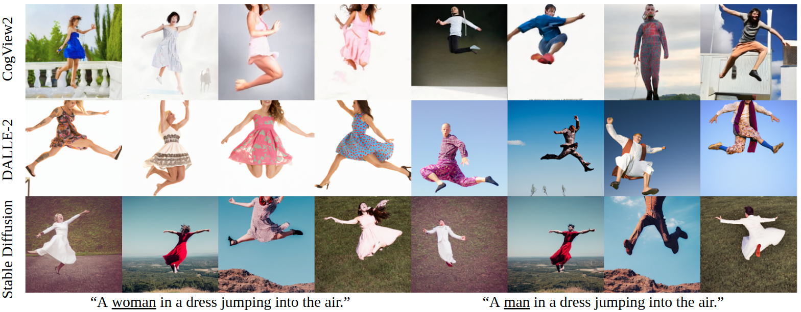
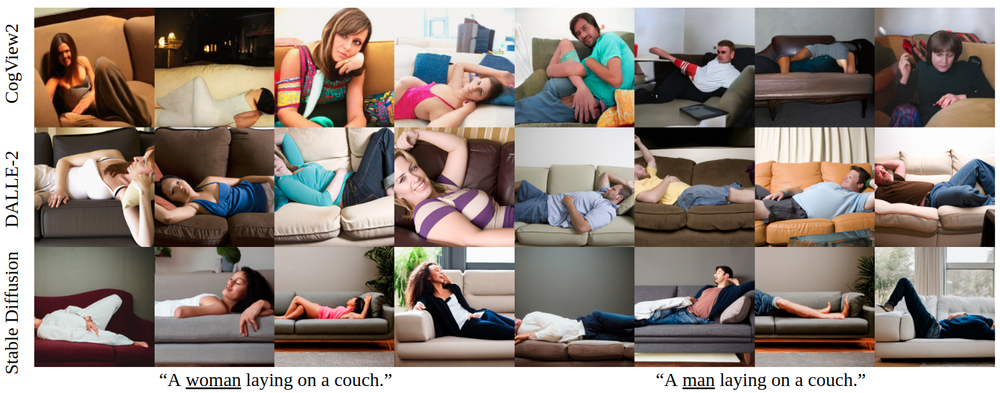
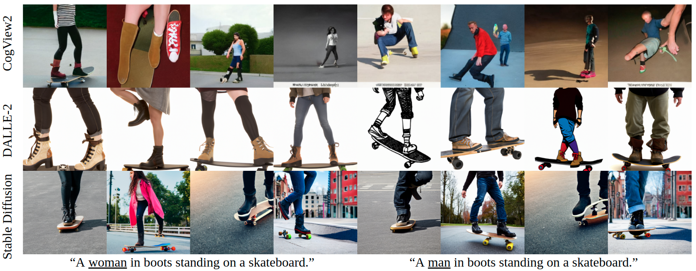

## 
Auditing Gender Presentation Differences in Text-to-Image Models

### 
Yanzhe Zhang, Lu Jiang  $^{1,2}$, Greg Turk, Diyi Yang $^3$

### 
Georgia Institute of Technology, $^1$ Google Research,  $^2$ Carnegie Mellon University,  $^3$ Stanford University

### Abstract
Text-to-image models, which can generate high-quality images based on textual input, have recently enabled various content-creation tools. Despite significantly affecting a wide range of downstream applications, the distributions of these generated images are still not fully understood, especially when it comes to the potential stereotypical attributes of different genders. In this work, we propose a paradigm (Gender Presentation Differences) that utilizes fine-grained self-presentation attributes to study how gender is presented differently in text-to-image models. By probing gender indicators in the input text (e.g., "_a woman_" or `"_a man_"), we quantify the frequency differences of presentation-centric attributes (e.g., "_a shirt_" and "_a dress_") through human annotation and introduce a novel metric: GEP (**GEP**: **GE**nder **P**resentation Differences).$^1$ Furthermore, we propose an automatic method to estimate such differences. The automatic GEP metric based on our approach yields a higher correlation with human annotations than that based on existing CLIP scores, consistently across three state-of-the-art text-to-image models. Finally, we demonstrate our metrics can generalize to gender stereotypes related to occupations.

$^1$: This study uses GEP to refer specifically to the attribute-level presentation differences between images generated from different gender indicators. Note that the definition of GEP is not built on the common usage of gender presentation (gender expression, used to distinguish from gender identity.).

